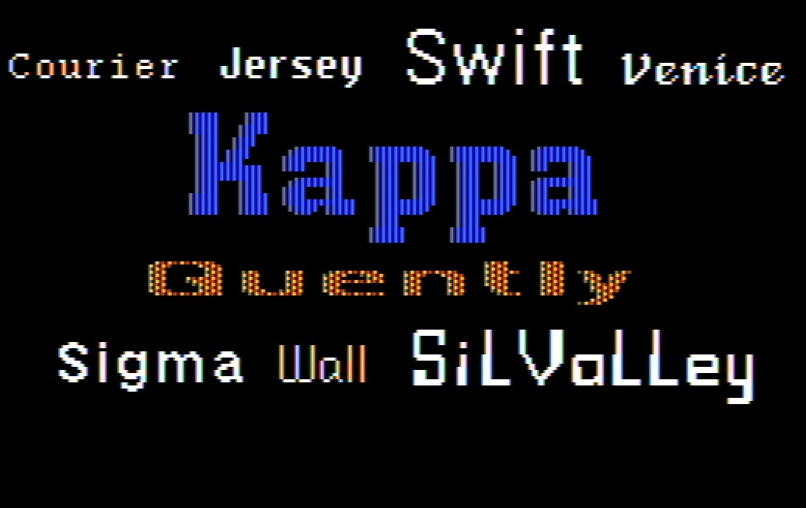

# 816-Paint-For-A2-Desktop

I am not sure if others have already figured this out, but I think I've gotten
816 Paint working pretty well on A2 Desktop. There were a few issues preventing
816 from being fun to use with A2D:

- Has to be on root volume else fonts and printers don't work
- The fonts aren't that great
- It doesn't quit cleanly back to A2D (goes to monitor)

The first fix was easy, though it took a bit of thrashing to figure out.
You can put 816 in any directory you like, that's kinda the point of 
A2 Desktop. Just move the SYSTEM directory to the root of that drive.
SYSTEM has FONTS and PRINTERS directories. You can add any fonts you want
to FONTS, up to about ten or so (needs to fit on screen). The IIgs font
pack from What is the Apple IIgs? works great.

The quit issue was a bit more involved. Both exes have this problem.

`PAINT.DBL.HIRES`

`PAINT.STD.HIRES`

They both have the correct return path, but we never get there:

`JSR $BF00`

`.BYTE $65`

The problem is that immediately before that code 816 tests location `$E17E` and
conditionally branches to an older exit path. On an A2D environment that branch
is taken, and the program jumps to the monitor/reset routine at `$FA62`.

`Original:`

`10 14 BPL <old exit path>`

Those have been replaced with NOP codes so it falls through to the real quit:

`EA NOP`

`EA NOP`

Four bytes changed.
