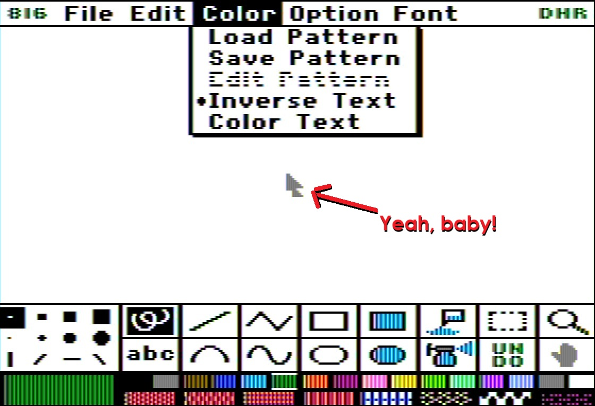

<!--
# 816-Paint-For-A2-Desktop

I am not sure if others have already figured these out, but I think I've gotten
8/16 Paint working pretty well on A2 Desktop. There were a few issues preventing
816 from being fun to use with A2D:
-->

# 8/16 𝐏𝐚𝐢𝐧𝐭 𝐅𝐨𝐫 𝐀𝐩𝐩𝐥𝐞 𝐈𝐈 𝐃𝐞𝐬𝐤𝐭𝐨𝐩

𝐈 𝐚𝐦 𝐧𝐨𝐭 𝐬𝐮𝐫𝐞 𝐢𝐟 𝐨𝐭𝐡𝐞𝐫𝐬 𝐡𝐚𝐯𝐞 𝐚𝐥𝐫𝐞𝐚𝐝𝐲 𝐟𝐢𝐠𝐮𝐫𝐞𝐝 𝐭𝐡𝐞𝐬𝐞 𝐨𝐮𝐭, 𝐛𝐮𝐭 𝐈 𝐭𝐡𝐢𝐧𝐤 𝐈'𝐯𝐞 𝐠𝐨𝐭𝐭𝐞𝐧
8/16 Paint 𝐰𝐨𝐫𝐤𝐢𝐧𝐠 𝐩𝐫𝐞𝐭𝐭𝐲 𝐰𝐞𝐥𝐥 𝐨𝐧
[A2 Desktop](https://github.com/a2stuff/a2d).
𝐓𝐡𝐞𝐫𝐞 𝐰𝐞𝐫𝐞 𝐚 𝐟𝐞𝐰 𝐢𝐬𝐬𝐮𝐞𝐬 𝐩𝐫𝐞𝐯𝐞𝐧𝐭𝐢𝐧𝐠
8/16 𝐟𝐫𝐨𝐦 𝐛𝐞𝐢𝐧𝐠 𝐟𝐮𝐧 𝐭𝐨 𝐮𝐬𝐞 𝐰𝐢𝐭𝐡 𝐀2𝐃:

<!--
- Has to be on root volume else fonts and printers don't work
- The fonts aren't that great
- It doesn't quit cleanly back to A2D (goes to monitor)
- The menus don't persist on click - it's a draaag, man
-->
- 𝐇𝐚𝐬 𝐭𝐨 𝐛𝐞 𝐨𝐧 𝐫𝐨𝐨𝐭 𝐯𝐨𝐥𝐮𝐦𝐞 𝐞𝐥𝐬𝐞 𝐟𝐨𝐧𝐭𝐬 𝐚𝐧𝐝 𝐩𝐫𝐢𝐧𝐭𝐞𝐫𝐬 𝐝𝐨𝐧'𝐭 𝐰𝐨𝐫𝐤
- 𝐓𝐡𝐞 𝐟𝐨𝐧𝐭𝐬 𝐚𝐫𝐞𝐧'𝐭 𝐭𝐡𝐚𝐭 𝐠𝐫𝐞𝐚𝐭
- 𝐈𝐭 𝐝𝐨𝐞𝐬𝐧'𝐭 𝐪𝐮𝐢𝐭 𝐜𝐥𝐞𝐚𝐧𝐥𝐲 𝐛𝐚𝐜𝐤 𝐭𝐨 A2 Desktop (𝐠𝐨𝐞𝐬 𝐭𝐨 𝐦𝐨𝐧𝐢𝐭𝐨𝐫)
- 𝐓𝐡𝐞 𝐦𝐞𝐧𝐮𝐬 𝐝𝐨𝐧'𝐭 𝐩𝐞𝐫𝐬𝐢𝐬𝐭 𝐨𝐧 𝐜𝐥𝐢𝐜𝐤 - 𝐢𝐭'𝐬 𝐚 𝐝𝐫𝐚𝐚𝐚𝐠, 𝐦𝐚𝐧
  
<!--
The first fix was easy, though it took a bit of thrashing to figure out.
You can put 816 in any directory you like, that's kinda the point of 
A2 Desktop. Just move the SYSTEM directory to the root of that drive.
SYSTEM has FONTS and PRINTERS directories. You can add any fonts you want
to FONTS, up to about ten or so (needs to fit on screen). The IIgs font
pack from What is the Apple IIgs? works great.
-->
𝐓𝐡𝐞 𝐟𝐢𝐫𝐬𝐭 𝐟𝐢𝐱 𝐰𝐚𝐬 𝐞𝐚𝐬𝐲, 𝐭𝐡𝐨𝐮𝐠𝐡 𝐢𝐭 𝐭𝐨𝐨𝐤 𝐚 𝐛𝐢𝐭 𝐨𝐟 𝐭𝐡𝐫𝐚𝐬𝐡𝐢𝐧𝐠 𝐭𝐨 𝐟𝐢𝐠𝐮𝐫𝐞 𝐨𝐮𝐭.
𝐘𝐨𝐮 𝐜𝐚𝐧 𝐩𝐮𝐭 8/16 𝐢𝐧 𝐚𝐧𝐲 𝐝𝐢𝐫𝐞𝐜𝐭𝐨𝐫𝐲 𝐲𝐨𝐮 𝐥𝐢𝐤𝐞, 𝐭𝐡𝐚𝐭'𝐬 𝐤𝐢𝐧𝐝𝐚 𝐭𝐡𝐞 𝐩𝐨𝐢𝐧𝐭 𝐨𝐟 
𝐀2 𝐃𝐞𝐬𝐤𝐭𝐨𝐩. 𝐉𝐮𝐬𝐭 𝐦𝐨𝐯𝐞 𝐭𝐡𝐞 𝐒𝐘𝐒𝐓𝐄𝐌 𝐝𝐢𝐫𝐞𝐜𝐭𝐨𝐫𝐲 𝐭𝐨 𝐭𝐡𝐞 𝐫𝐨𝐨𝐭 𝐨𝐟 𝐭𝐡𝐚𝐭 𝐝𝐫𝐢𝐯𝐞.
𝐒𝐘𝐒𝐓𝐄𝐌 𝐡𝐚𝐬 𝐅𝐎𝐍𝐓𝐒 𝐚𝐧𝐝 𝐏𝐑𝐈𝐍𝐓𝐄𝐑𝐒 𝐝𝐢𝐫𝐞𝐜𝐭𝐨𝐫𝐢𝐞𝐬. 𝐘𝐨𝐮 𝐜𝐚𝐧 𝐚𝐝𝐝 𝐚𝐧𝐲 𝐟𝐨𝐧𝐭𝐬 𝐲𝐨𝐮 𝐰𝐚𝐧𝐭
𝐭𝐨 𝐅𝐎𝐍𝐓𝐒, 𝐮𝐩 𝐭𝐨 𝐚𝐛𝐨𝐮𝐭 𝐟𝐢𝐟𝐭𝐞𝐞𝐧 𝐨𝐫 𝐬𝐨 (𝐧𝐞𝐞𝐝𝐬 𝐭𝐨 𝐟𝐢𝐭 𝐨𝐧 𝐬𝐜𝐫𝐞𝐞𝐧). 𝐓𝐡𝐞 𝐈𝐈𝐠𝐬 𝐟𝐨𝐧𝐭
𝐩𝐚𝐜𝐤 𝐟𝐫𝐨𝐦 𝐖𝐡𝐚𝐭 𝐢𝐬 𝐭𝐡𝐞 𝐀𝐩𝐩𝐥𝐞 𝐈𝐈𝐠𝐬? 𝐰𝐨𝐫𝐤𝐬 𝐠𝐫𝐞𝐚𝐭.

<!--
The quit issue was a bit more involved. Both exes have this problem.
-->
𝐓𝐡𝐞 𝐪𝐮𝐢𝐭 𝐢𝐬𝐬𝐮𝐞 𝐰𝐚𝐬 𝐚 𝐛𝐢𝐭 𝐦𝐨𝐫𝐞 𝐢𝐧𝐯𝐨𝐥𝐯𝐞𝐝. 𝐁𝐨𝐭𝐡 𝐞𝐱𝐞𝐬 𝐡𝐚𝐯𝐞 𝐭𝐡𝐢𝐬 𝐩𝐫𝐨𝐛𝐥𝐞𝐦.

`PAINT.DBL.HIRES`

`PAINT.STD.HIRES`
<!--
They both have the correct return path, but we never get there:
-->
𝐓𝐡𝐞𝐲 𝐛𝐨𝐭𝐡 𝐡𝐚𝐯𝐞 𝐭𝐡𝐞 𝐜𝐨𝐫𝐫𝐞𝐜𝐭 𝐫𝐞𝐭𝐮𝐫𝐧 𝐩𝐚𝐭𝐡, 𝐛𝐮𝐭 𝐰𝐞 𝐧𝐞𝐯𝐞𝐫 𝐠𝐞𝐭 𝐭𝐡𝐞𝐫𝐞:

`JSR $BF00`

`.BYTE $65`

<!--
The problem is that immediately before that code 816 tests location `$E17E` and
conditionally branches to an older exit path. On an A2D environment that branch
is taken, and the program jumps to the monitor/reset routine at `$FA62`.
-->
𝐓𝐡𝐞 𝐩𝐫𝐨𝐛𝐥𝐞𝐦 𝐢𝐬 𝐭𝐡𝐚𝐭 𝐢𝐦𝐦𝐞𝐝𝐢𝐚𝐭𝐞𝐥𝐲 𝐛𝐞𝐟𝐨𝐫𝐞 𝐭𝐡𝐚𝐭 𝐜𝐨𝐝𝐞 816 𝐭𝐞𝐬𝐭𝐬 𝐥𝐨𝐜𝐚𝐭𝐢𝐨𝐧 `$E17E` 𝐚𝐧𝐝
𝐜𝐨𝐧𝐝𝐢𝐭𝐢𝐨𝐧𝐚𝐥𝐥𝐲 𝐛𝐫𝐚𝐧𝐜𝐡𝐞𝐬 𝐭𝐨 𝐚𝐧 𝐨𝐥𝐝𝐞𝐫 𝐞𝐱𝐢𝐭 𝐩𝐚𝐭𝐡. 𝐎𝐧 𝐚𝐧 𝐀2𝐃 𝐞𝐧𝐯𝐢𝐫𝐨𝐧𝐦𝐞𝐧𝐭 𝐭𝐡𝐚𝐭 𝐛𝐫𝐚𝐧𝐜𝐡
𝐢𝐬 𝐭𝐚𝐤𝐞𝐧, 𝐚𝐧𝐝 𝐭𝐡𝐞 𝐩𝐫𝐨𝐠𝐫𝐚𝐦 𝐣𝐮𝐦𝐩𝐬 𝐭𝐨 𝐭𝐡𝐞 𝐦𝐨𝐧𝐢𝐭𝐨𝐫/𝐫𝐞𝐬𝐞𝐭 𝐫𝐨𝐮𝐭𝐢𝐧𝐞 𝐚𝐭 `$FA62`.

𝐎𝐫𝐢𝐠𝐢𝐧𝐚𝐥:

`10 14 BPL <old exit path>`

<!--
Those have been replaced with NOP codes so it falls through to the real quit:
-->
𝐓𝐡𝐨𝐬𝐞 𝐡𝐚𝐯𝐞 𝐛𝐞𝐞𝐧 𝐫𝐞𝐩𝐥𝐚𝐜𝐞𝐝 𝐰𝐢𝐭𝐡 𝐍𝐎𝐏 𝐜𝐨𝐝𝐞𝐬 𝐬𝐨 𝐢𝐭 𝐟𝐚𝐥𝐥𝐬 𝐭𝐡𝐫𝐨𝐮𝐠𝐡 𝐭𝐨 𝐭𝐡𝐞 𝐫𝐞𝐚𝐥 𝐪𝐮𝐢𝐭:

`EA NOP`

`EA NOP`

<!--
Four bytes changed.

The menu modification took quite a bit of digging, but we have:

Original:
-->
𝐅𝐨𝐮𝐫 𝐛𝐲𝐭𝐞𝐬 𝐜𝐡𝐚𝐧𝐠𝐞𝐝.

𝐓𝐡𝐞 𝐦𝐞𝐧𝐮 𝐦𝐨𝐝𝐢𝐟𝐢𝐜𝐚𝐭𝐢𝐨𝐧 𝐭𝐨𝐨𝐤 𝐪𝐮𝐢𝐭𝐞 𝐚 𝐛𝐢𝐭 𝐨𝐟 𝐝𝐢𝐠𝐠𝐢𝐧𝐠, 𝐛𝐮𝐭 𝐰𝐞 𝐡𝐚𝐯𝐞:

𝐎𝐫𝐢𝐠𝐢𝐧𝐚𝐥:

`24 D5 BIT $D5 ; button-up transition`

<!--
Is now:
-->
𝐈𝐬 𝐧𝐨𝐰:

`24 D4 BIT $D4 ; button-down transition`

<!--
So:
-->
𝐒𝐨:

`$06AC7: D5 -> D4`

`$0EF1C: D5 -> D4`

<!--
Two bytes changed.
-->
𝐓𝐰𝐨 𝐛𝐲𝐭𝐞𝐬 𝐜𝐡𝐚𝐧𝐠𝐞𝐝.

